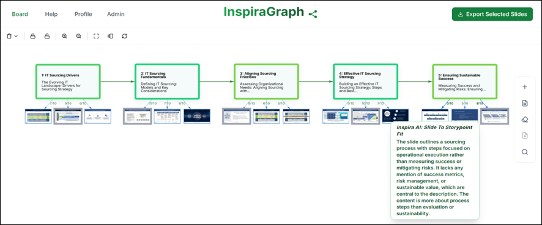

# InspiraGraph

End-to-end system for building, exploring and exporting slide "stories" from existing presentation decks. The frontend renders an interactive story graph (story points + slide thumbnails); the backend retrieves, ranks and assembles relevant slides using hybrid vector + graph search.



## Research Background

InspiraGraph is the further development of the research presented in:

> **[Developing a Hybrid Vector-Graph Retrieval System for Entity-Preserving and Inspiring Storyline Creation of Presentation Slides](https://aisel.aisnet.org/ecis2025/ai_org/ai_org/2/)**
> Alexander Meier, Mahei Manhai Li, Roman Rietsche
> *European Conference on Information Systems (ECIS), 2025*

The paper introduced design principles for configuring human-AI hybrid systems that leverage an existing corpus of presentation slides — combining **dense embeddings** with **graph-based retrieval** to support narrative creation. An evaluation across 15 think-aloud sessions and 73 user trials showed equal or improved slide quality compared to a ChatGPT-based chatbot baseline.

The current implementation extends the research ideas substantially and covers a broader set of features:

- **Interactive story graph canvas** — vis-network graph for visual narrative authoring; story points and slide nodes arranged in narrative order.
- **AI slide-to-storypoint fit scoring** — LLM-generated fit annotations displayed inline on the canvas.
- **PPTX and PDF export** — assemble selected slides into a downloadable presentation.
- **Experimental session watermarking** — server-side per-user watermarks for research data traceability.
- **Supabase-based auth & analytics** — user logging and consent tracking for longitudinal research studies.

## Repository Notes

This is the public mirror of the project. Stable, de-identified content is periodically merged here from the active development repository.

## Documentation

- **Architecture** — high-level diagram & data flow
  → [docs/architecture.md](docs/architecture.md)

- **Environment & Config** — required env vars (frontend + functions)
  → [docs/environment.md](docs/environment.md)

- **API Reference** — Netlify functions & endpoints used by the app
  → [docs/api-reference.md](docs/api-reference.md)

- **Frontend Overview** — graph rendering, hooks, image proxy integration points
  → [docs/frontend.md](docs/frontend.md)

- **Watermarking (experimental)** — per-user overlay details & decisions
  → [docs/watermarking.md](docs/watermarking.md)

- **Troubleshooting** — common pitfalls (sharp, CORS, latency, TS formatting)
  → [docs/troubleshooting.md](docs/troubleshooting.md)

## Quickstart

```bash
# install root deps
npm i

# install per-functions deps (sharp/jose live under netlify/functions)
npm i --prefix netlify/functions sharp jose

# development
netlify dev
```

- If you use `netlify dev`, it proxies `/.netlify/functions/*` to your functions.
- Make sure `FRONTEND_URL` (or `VITE_SITE_URL`) matches the origin you open in the browser (`http://localhost:8888` by default).

## Build & Deploy (Netlify)

- Set required environment variables (see **docs/environment.md**).
- Ensure *Functions bundling* installs `netlify/functions/package.json` (Netlify does this automatically).

Minimal `netlify.toml`:

```toml
[build]
command = "npm run build"
publish = "dist"

[functions]
node_bundler = "esbuild"
included_files = ["netlify/_shared/**"]
```

If you hit `Could not resolve "sharp"` during bundling, run:

```bash
npm i --prefix netlify/functions sharp jose
```

Then clear Netlify build cache and redeploy.

## Experimental Watermarking

Experimental users (those logged in via `experimental-login`/`qualtrics-exp-login`) receive **server-side composited watermarks** on each slide image via `/.netlify/functions/slide?objectId=...`. Replace all direct S3 references with calls to this function to ensure consistent behaviour and headers.

See [docs/watermarking.md](docs/watermarking.md) for details.
